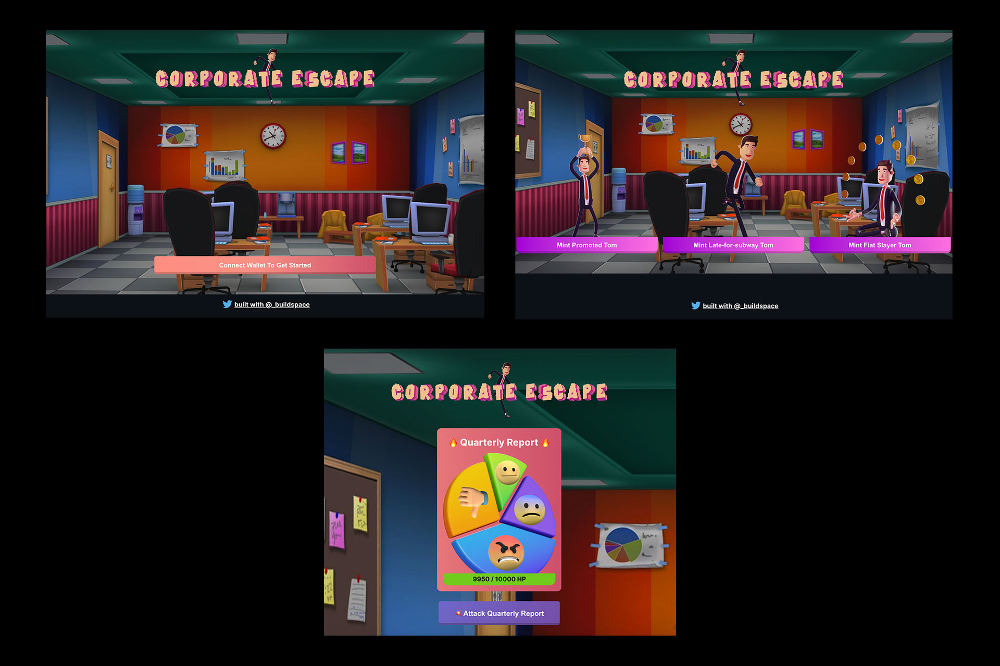
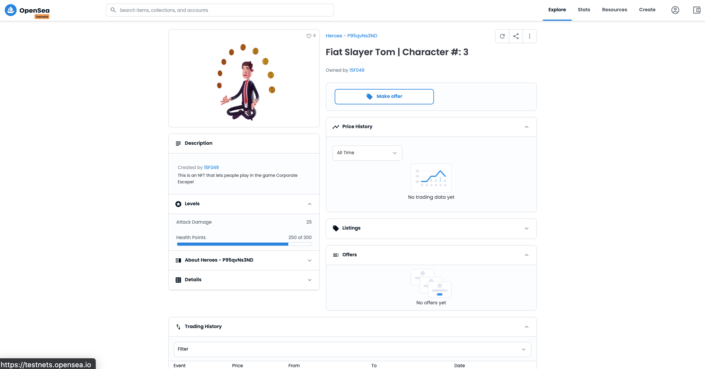
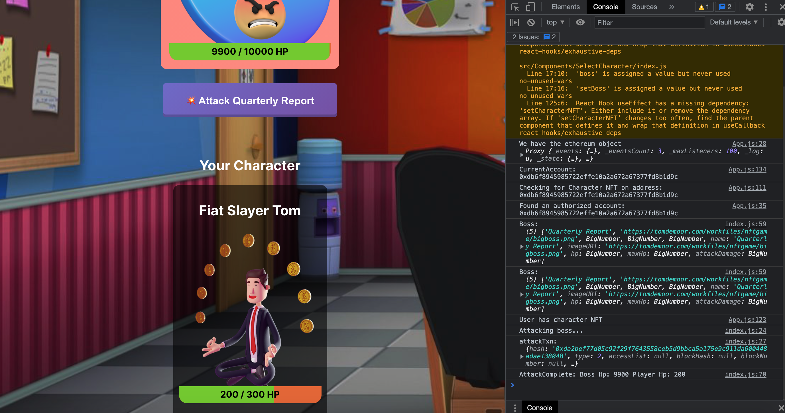
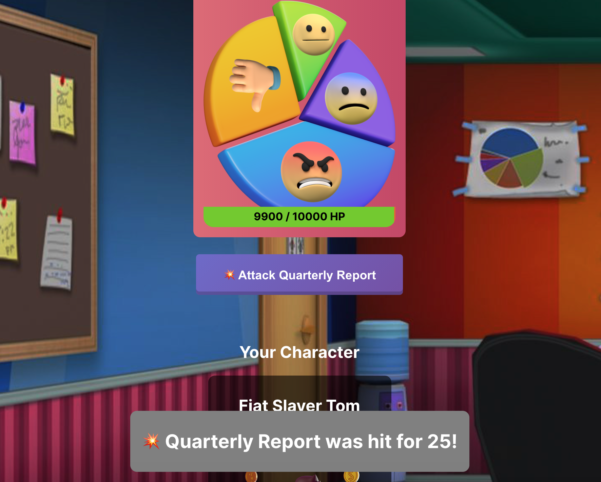

# Create your own mini turn-based NFT browser game by Buildspace.so 

## About This Project
This is an async, weekend project for curious devs that want to learn more about crypto + gaming by hacking together their own web3 game. You'll mint your own NFTs, make them playable characters in your game, and let users earn your own crypto as they win games. I recommend giving this a try if you are interested in Web3.

**Ship your NFT character system**
* 💻 Get local env all set up.
* 🌈 Running a basic contract.
* ⚔️ Setup data for character NFTs.
* 💎 Actually mint your NFTs locally.
* 🚀 Deploy to Rinkeby, see on OpenSea: https://testnets.opensea.io/collection/heroes-w2aquhrbii

**Ship the game logic.**
* ⚔️ Build boss + attack logic.
* 🚀 Deploy and see NFTs changing in prod.
* 🤠 Adding in some utility functions for our web app.

**Ship the web app.**
* 🔌 Building a connect to wallet button.
* 🔎 Checking for a Character NFT.
* 🏹 Building the Character Select page & Arena.

**Wrapping Up**
* 🔥 Finishing touches on the UI & Contract with user feedback and IPFS hosting.
* 🦄 NFT As proof of completion: https://opensea.io/assets/matic/0x3CD266509D127d0Eac42f4474F57D0526804b44e/1953?force_update=true
